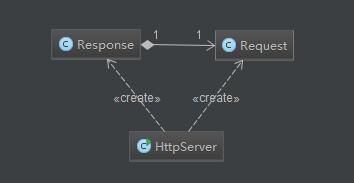

### Program Description

This Program(ch1.pyrmont) contains three class files.

* HttpServer.java
* Request.java
* Response.java

This is a tiny HTTP server program which based on class `java.net.ServerSocker`.
A server socket waits for requests to come in over the network.  It performs some operation based on that request, and then possibly returns a result to the requester.

The entry point of this application (the static main method) can be found in the HttpServer class. The main method creates an instance of HttpServer and calls its await method. The await method, as the name implies, waits for HTTP requests on a designated port, processes them, and sends responses back to the clients. It keeps waiting until a shutdown command is received. 

This image shows the UML relationship between these class

The application cannot do more than sending static resources, such as HTML files and image files, residing in a certain directory. It also displays the incoming HTTP request byte streams on the console. However, it does not send any header, such as dates or cookies, to the browser.

Once you create an instance of the Socket class successfully, you can use it to send and receive streams of bytes. 

To send byte streams, you must first call the Socket class's getOutputStream method to obtain a `java.io.OutputStream` object.

To send text to a remote application, you often want to construct a `java.io.PrintWriter` object from the OutputStream object returned. 
To receive byte streams from the other end of the connection, you call the Socket class's getInputStream method that returns a `java.io.InputStream`.

Usage:

### Run the server 

With the commands __java ch1.pyrmont.HttpServer__ under terminal.

### Access the server

1. You can access the server(localhost:8080/index.html) with the help of your browser.

2. You can run the client program `java.text.ch1.pyrmont.HttpClient` which written by me. It will create a socket and connect to the server. Then it will send a request to the server. Finally, the client will print out all the message that it get from the response of the server.

